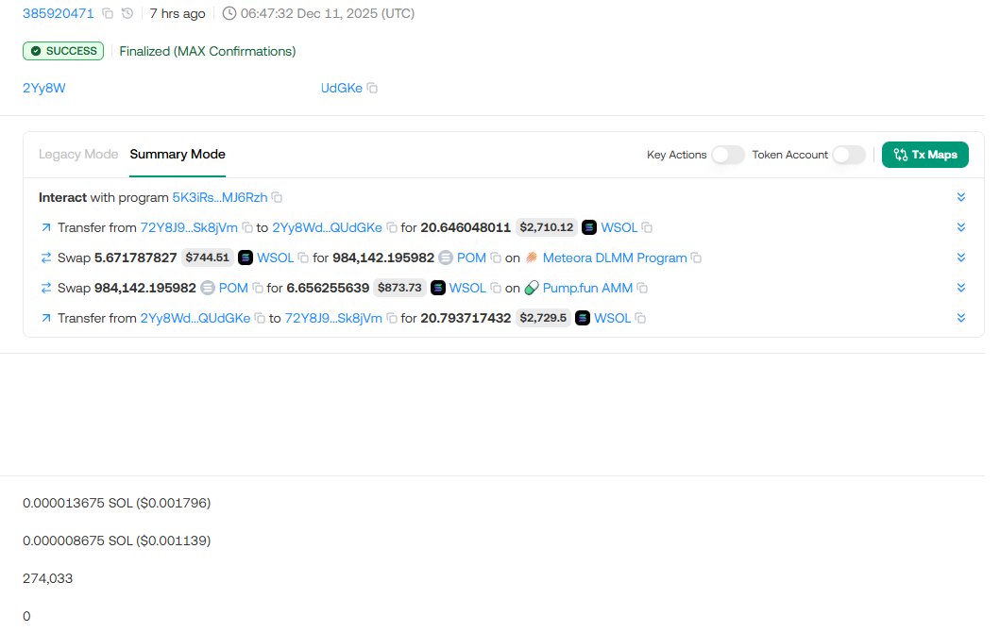

# **ZavodMevBot**

Automated Solana On-Chain Arbitrage Bot

---

## 🚀 Introduction

**ZavodMevBot** is an advanced, fully-automated, compute-optimized, flash-loan–enabled **Solana On-chain Arbitrage Bot** built in Rust for maximum speed and reliability.

Designed as a next-generation alternative to tools like SolanaMevBot and NotArb, **ZavodMevBot delivers superior performance, faster execution, and higher profitability** based on extensive real-world testing.

**No need to hunt for arbitrage pairs manually.**
**ZavodMevBot** continuously scans the entire Solana ecosystem and executes profitable opportunities automatically.

**No upfront SOL required for swaps.**
Thanks to integrated flash-loan support, you only need a small amount of SOL for gas fees—**ZavodMevBot** handles the rest.

**ZavodMevBot includes everything you need.**
Just run it, let it operate autonomously, and watch profitable arbitrage transactions roll in.

---

## 💡 Key Features

### **🔍 Search Engine in Multi-DEX**

**ZavodMevBot** supports dynamic pool discovery and execution across:

- Pump.Amm Pools
- Meteora DLMM
- Raydium CPMM
- Raydium AMM
- Meteora AmmV2
- Raydium CLMM
- Orca (Whirlpools)
- ...

### **🧠 Smart Opportunity Detection**

- Real-time price monitoring
- Efficient path computation
- Optimal trade size calculation

### **⚡ Ultra-Fast Execution**

- Optimized Rust-based engine
- Jito bundle support
- Low-latency RPC support

### **🔐 Safety & Reliability**

- Transaction simulation before send
- Slippage awareness and error recovery
- Automated blockhash refreshing

---

## 🌊 How **ZavodMevBot** Works

1. **Monitors pools** across all supported DEXes in real-time.
2. **Identifies profitable price deviations** where a token can be swapped between pools for a net gain.
3. **Calculates optimal trade size** considering liquidity depth and fees.
4. **Builds and sends transactions** via High-speed RPC Providers.
5. **Tracks profit, volume, and performance** automatically.

---

## 🔧 Configuration

Users can customize:

- Minimum profit threshold
- Token whitelist / blacklist
- Pool liquidity filters
- Priority fee settings
- When to stop and start

---

## 📈 Why Choose **ZavodMevBot**?

Because **ZavodMevBot** is designed to be:

- **Fast** – written in Rust and optimized for concurrency
- **Reliable** – safe error handling and fallback mechanisms
- **Profitable** – intelligently finds and executes high-yield opportunities
- **Scalable** – handles thousands of pools efficiently

Whether you're a beginner or a seasoned Solana trader, **ZavodMevBot** empowers you with institutional-grade arbitrage technology.

---

## 🐳 Future Enhancements

- Multi-hop arbitrage (triangular)
- Mobile and web dashboards
- Bot-as-a-service cloud option

---

## 📬 Contact & Support

Have questions or want to know details?

- **Telegram:** [**ZavodMevBot**](https://t.me/ZavodMevBot_Monitor)

